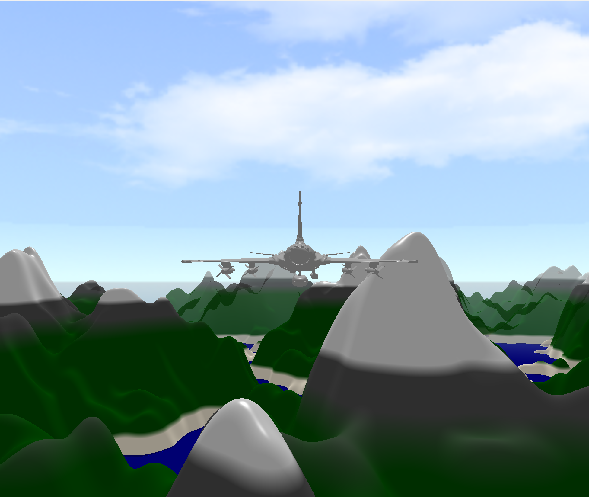

# Flight Simulator

This is a flight simulator created in the course TSBK07 Computer Graphics. The simulator is written in C++ and uses OpenGL for rendering. The simulator is based on the physics of a plane and the user can control the plane with the keyboard. The simulator also includes a procedural terrain generator, which generates a terrain based on simplex noise.

## Controls
- W: Pitch Up
- S: Pitch Down
- A: Roll Left
- D: Roll Right
- Arrow Up: Increase throttle
- Arrow Down: Decrease throttle
- K: Decrease light intensity
- L: Increase light intensity
- R: Toggle Game Mode
- 1: Boeing 747
- 2: Airbus A380
- 3: Privat Jet
- Esc: Exit
